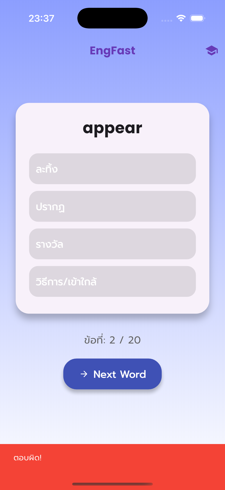

# 📱 EngFast - Vocabulary Flashcard & Quiz App

EngFast คือแอปฝึกคำศัพท์ภาษาอังกฤษแบบรวดเร็ว 🚀  
เน้นทั้งการท่องจำและการทำ Quiz เพื่อทบทวนในรูปแบบที่สนุกและใช้งานง่าย ✨

---

## ✨ ฟีเจอร์หลัก

- 🔤 Flashcard คำศัพท์ พร้อมแปลไทย
- 🧠 โหมด Quiz แบบสุ่มตัวเลือก
- 🎯 แสดงผลคะแนนหลังทำเสร็จ
- 📊 บันทึกคะแนนล่าสุดด้วย SharedPreferences
- 🌈 UI สวยงาม รองรับทั้ง iOS และ Android

---

## 📸 Screenshots

### iOS

| หน้า Home | แสดงคำแปล | โหมด Quiz |
|-----------|------------|------------|
|  |  |  |

| ตอบถูก | ตอบผิด | สรุปผล |
|--------|--------|--------|
|  |  |  |

---

### Android

| หน้า Home | แสดงคำแปล | โหมด Quiz |
|-----------|------------|------------|
|  |  |  |

| ตอบถูก | ตอบผิด | สรุปผล |
|--------|--------|--------|
|  |  |  |

---

## 🚀 วิธีติดตั้งและรันแอป

1. โคลน repo นี้:
```bash
git clone https://github.com/your-username/engfast.git
cd engfast
```

2. ติดตั้ง package ที่จำเป็น:
```bash
flutter pub get
```

3. รันบน Emulator หรือ Device จริง:
```bash
flutter run
```

---

## 🛠 เทคโนโลยีที่ใช้

- Flutter 3+
- Dart
- Google Fonts
- Shared Preferences
- Material 3

---

## 🗂 โครงสร้างแอปพลิเคชัน

```
lib/
├── data/
│   └── word_list.json        # 🔄 ไฟล์ JSON ที่เก็บคำศัพท์ (สามารถแก้ไขได้)
│
├── models/
│   └── word.dart             # โมเดลคลาส Word (word + meaning)
│
├── screens/
│   ├── home_screen.dart      # หน้าหลัก (Flashcard & Quiz)
│   └── result_screen.dart    # หน้าสรุปผลคะแนน
│
├── widgets/
│   └── word_card.dart        # Widget สำหรับแสดงคำศัพท์ใน Flashcard
│
└── main.dart                 # จุดเริ่มต้นของแอป
```

---

## 🔄 เปลี่ยนชุดคำศัพท์ง่าย ๆ แค่แก้ `word_list.json`

แอปรองรับการเปลี่ยนคำศัพท์โดยตรงผ่านไฟล์  
**`lib/data/word_list.json`**

โครงสร้างข้อมูลเป็นแบบง่าย ๆ:

```json
[
  {
    "word": "awesome",
    "meaning": "ยอดเยี่ยม"
  },
  {
    "word": "appear",
    "meaning": "ปรากฏ"
  }
]
```

คุณสามารถ:
- ✅ เปลี่ยนคำศัพท์ทั้งหมด
- ➕ เพิ่มคำใหม่

แค่แก้ `word_list.json` ก็พร้อมใช้งานกับ UI เดิมทันที ✨

---

## 🙌 ขอบคุณที่ใช้งาน EngFast!
แอปดี ๆ สำหรับทุกคนที่อยากเก่งอังกฤษแบบเร็วไว 🔥

---

หากคุณชอบโปรเจกต์นี้ อย่าลืม ⭐ Star บน GitHub นะครับ 😊
